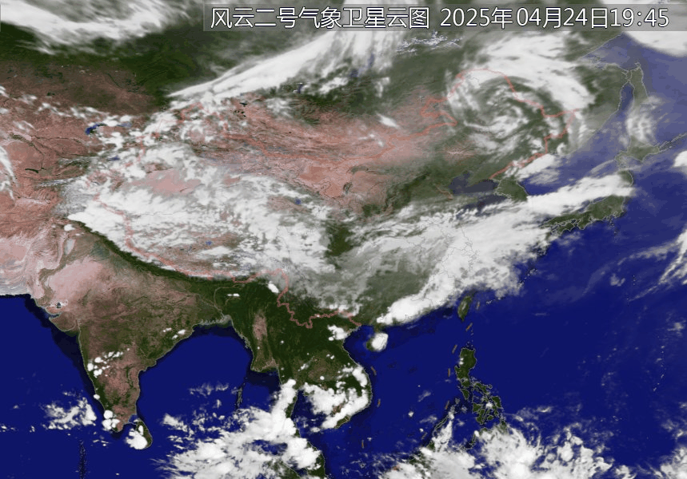

# CloudInterp
Interpolate satellite cloud images into smooth animations. 

**CloudInterp** is a Python tool designed to interpolate satellite cloud images and generate smooth transition animations. By processing a time series of satellite imagery, it creates continuous `.gif` or `.mp4` videos, ideal for meteorological visualization, scientific communication, or educational use.

## Quick Start
 Python Version = 3.9
### 🛠 Install Dependencies

```bash
pip install opencv-python numpy imageio
```

### 🚀 Run Example
#### Example 1: interpolate satellite cloud between 2 images.
```bash
python cloudInterp.py
```
#### Example 2: Batch interpolate satellite cloud between many images and make them into one `mp4` video.
```bash
python cloudInterpBatch.py
```
### 🚀 Effect

## Next Step
 I want this function can execute within browser. As I know, I do NOT find similar library run within browser.  
 Now, please see [Next Version ](README_V2.md)